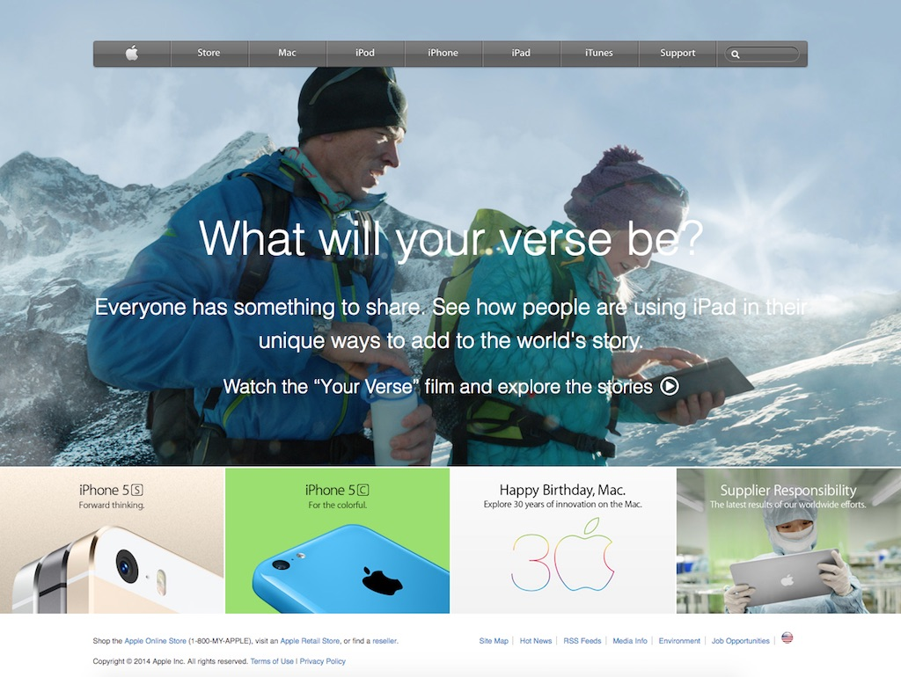

# Building with Backgrounds and Gradients

## Microverse curiculum 1st solo project

## Clone of old version of Apple page.

In this project I cloned the website of one of the most design-forward companies in the world. It’s not a very complex site but it uses background photos well and the navbar at the top contains a gradient that was able to mimic.

Used:
 * HTML5
 * CSS Grid
 
## Author

 * Nick Haralampopoulos https://github.com/macnick

## Screenshot

 

## The Website

Follow the link to acess to the Website: https://macnick.github.io/apple-page/
